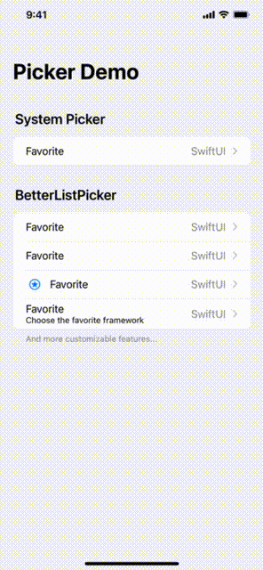

# BetterListPicker

An alternative customizable list picker to replace built-in non customizable `Picker` when we write settings view codes.

## Demo



## Requirements

iOS 14.0+, macOS 11.0+, watchOS 7.0+, tvOS 14.0+

## Installation

#### Swift Package Manager (Recommended)

- Xcode >  File > Swift Packages > Add Package Dependency
- Add `https://github.com/Jinya/BetterListPicker.git`
- Select "Exact Version" (recommend using the latest exact version)

## How to Use

Sample codes, see more in Demo App...
```swift
import SwiftUI
import BetterListPicker

enum Framework: String, CaseIterable {
    case appkit = "AppKit"
    case uikit = "UIKit"
    case swiftui = "SwiftUI"
}

extension Framework: BetterListPickerValuable {
    var id: String { self.rawValue }
    var titleKey: LocalizedStringKey { LocalizedStringKey(self.rawValue) }
}

struct ContentView: View {

    @State var favorite: Framework = .swiftui

    var body: some View {
        NavigationView {
            List {
                Section {
                    BetterListPicker("Favorite",
                                     selectionValue: $favorite,
                                     pickerValues: Framework.allCases)

                    BetterListPicker("Favorite",
                                     selectionValue: $favorite,
                                     pickerValues: Framework.allCases,
                                     pickerListSectionHeader: { Text("Header") },
                                     pickerListSectionFooter: { EmptyView() })

                    BetterListPicker($favorite,
                                     pickerValues: Framework.allCases) {
                        Text("Custom Navigation Title")
                    } pickerListSectionFooter: {
                        Text("Footer")
                    } label: {
                        Label("Favorite", systemImage: "star.circle")
                    }

                    BetterListPicker($favorite,
                                     pickerValues: Framework.allCases) {
                        Text("Custom Navigation Title 2")
                    } pickerListSectionHeader: {
                        Text("Header")
                    } pickerListSectionFooter: {
                        Text("Footer")
                    } label: {
                        VStack(alignment: .leading) {
                            Text("Favorite")
                            Text("Choose the favorite framework")
                                .font(.footnote)
                        }
                    }
                } header: {
                    Text("BetterListPicker")
                } footer: {
                    Text("And more customizable features...")
                }
            }
            .navigationTitle("Picker Demo")
        }
    }
}
```


## MIT License 

BetterListPicker released under the MIT license. See LICENSE for details.
